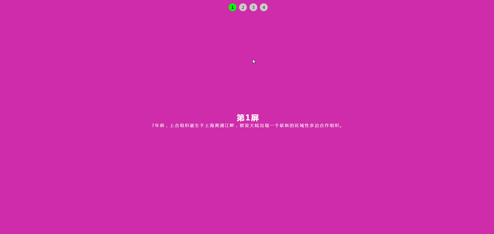

# vue-pages-toggle

> 基于 vue 的页面轮播

## example
[在线demo](https://wqb2017.github.io/vue-pages-toggle/)



## use

1. install vue-pages-toggle

   npm install vue-pages-toggle --save

2. main.js import

```main.js
import vuePagesToggle from 'vue-pages-toggle';
Vue.use(vuePagesToggle);
```

```html
    <pages-toggle :pages-keys-active-style="{'background':'#0f0'}" :swipe-time="3000" animation-duration="2s">
      <pages-toggle-panel>
        <div class="demo demo1">
          <h3>第1屏</h3>
          <p>7年前，上合组织诞生于上海黄浦江畔，欧亚大陆出现一个崭新的区域性多边合作组织。</p>
        </div>
      </pages-toggle-panel>
      <pages-toggle-panel>
        <div class="demo demo2">
          <h3>第2屏</h3>
          <p>从最初的6个成员国发展到现在的8个成员国、4个观察员国、6个对话伙伴，上合组织发展道路越走越宽，务实合作成果越来越多，国际影响越来越大。</p>
        </div>
      </pages-toggle-panel>
      <pages-toggle-panel>
        <div class="demo demo3">
          <h3>第3屏</h3>
          <p>“互信、互利、平等、协商、尊重多样文明、谋求共同发展”，同上合组织相伴而生的“上海精神”如同一座高耸的灯塔，为上合组织持续发展指引方向。</p>
        </div>
      </pages-toggle-panel>
      <pages-toggle-panel>
        <div class="demo demo4">
          <h3>第4屏</h3>
          <p>新时代、新气象、新作为。扩员后再次回到诞生地中国，上合组织青岛峰会更具继往开来的特殊意味，承载着各方的美好期待。</p>
        </div>
      </pages-toggle-panel>
    </pages-toggle>
```

## api

```js
@param {String} position 定位，默认定位上面
@param {Boolean} isPagesKeys 是否显示keys，默认显示
@param {Object, Array} pagesKeysStyle keys样式
@param {Object, Array} pagesKeysActiveStyle keys选中样式
@param {Boolean} isUseKeydown 是否启动键盘事件,默认不启动
@param {Number} swipeTime 轮播时间，默认2000ms
@param {Function} success 轮播成功回调
@param {String} animationDuration 动画完成时间，默认4s，不使用动画设置为0s即可
@param {String} animationTimingFunction 规定动画的速度曲线，默认linear
@param {String} animationDelay 何时开始动画，默认0s
@param {Number} animationIterationCount 设置或返回动画的播放次数，默认1次
@param {String} animationDirection 设置或返回是否循环交替反向播放动画，默认normal
@param {String} animationFillMode 属性规定当动画不播放时（当动画完成时，或当动画有一个延迟未开始播放时），要应用到元素的样式，默认none
```

## warn

设置切换页面时间不要小于动画继续时间
